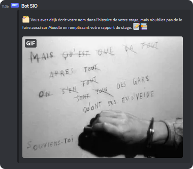
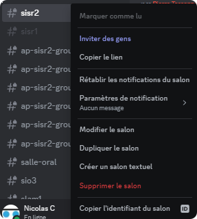
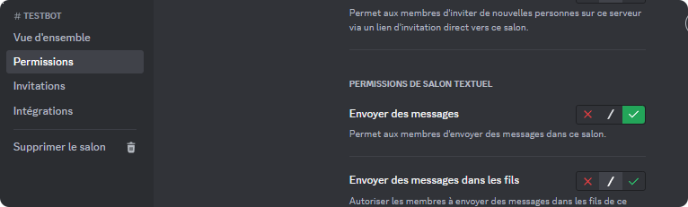

# Bot Discord pour rappeler aux stagiaires de publier un rapport de stage hebdomadaire sur la plateforme Moodle



# Objectif

Développer un Bot Discord en Python pour rappeler chaque fin de semaine de publier son rapport de stage.

# @TODO:

- améliorer la périodicité d'envoi (cron?)
- Interface de gestion des messages?

# Installation

Dépendances:

```bash
pip install -r requirements.txt
```

Lancement:
```bash
python3 bot_discord.py
```

# Configuration

Créer le fichier **.env** avec vos valeurs.

Pour récupérer les IDs des salons:


A configurer:
```dotenv
# Variables d'environnement à remplir avant!
GIPHY_API_KEY=

# Liste des IDs des salons séparés par des virgules et entre crochets
DISCORD_CHANNEL_IDS="00000000,11111111"

# Token de l'application
DISCORD_TOKEN=

# Date à laquelle le script ,du bot doit s'arrêter
MAX_DATE_YEAR=
# Ne pas mettre le 0 pour les mois avant octobre
MAX_DATE_MONTH=
MAX_DATE_DAY=

# Délai entre 2 envois en secondes (ici 7 jours)
#DELAY=604800     # "7 * 24 * 60 * 60"
DELAY=
```

# Sources

ChatGPT!
https://www.commentcoder.com/bot-discord-python/


# Utiliser des fichiers d'environnement dans Python

https://dev.to/jakewitcher/using-env-files-for-environment-variables-in-python-applications-55a1

# Créer un bot Discord

- Se rendre sur https://discord.com/developers/applications pour créer un bot

# Prompt utilisé sur ChatGPT pour la génération de messages

```
Rédige moi une liste de 30 messages contenant des emojis pour inciter des élèves en stage à penser à remplir leur rapport de stage hebdomadaire sur Moodle chaque fin de semaine. Tu dois avoir un ton rigolo mais rester pro. Les élèves doivent se sentir incités, motivés et encouragés. Les messages s'adressent à des étudiants en réseau informatique ou à des étudiants en développement. Les étudiants sont également des étudiantes. Tu ne dois pas ajouter de texte au début ni à la fin, et ne pas numéroter les lignes. Pas d'espace entre les lignes
```

# Prompt utilisé sur ChatGPT pour la génération de termes à utiliser sur giphy

```
Rédige moi une liste de 30 termes à utiliser pour rechercher des gifs funs sur la plateforme giphy. Ils doivent rappeler l'informatique, la pop culture, les memes. Ils doivent avoir un rapport avec la rédaction, le souvenir, l'urgence, le sérieux. La liste est sans texte avant ou après, pas d'espace entre chaque ligne
```

# Autorisations du bot sur le salon Discord

Le bot doit être membre du salon et avoir le droit d'envoyer des messages

